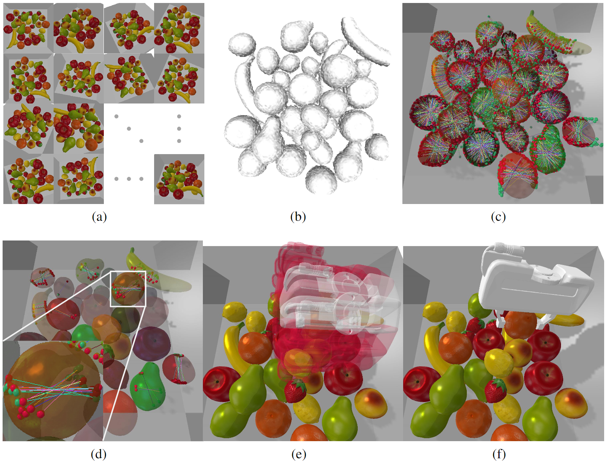

## Volumetric-based Contact Point Detection for 7-DoF Grasping

This repository contains the implementation of the work "Volumetric-based Contact Point Detection for 7-DoF Grasping", 
including data generation, network training, performance validation on simulator, and ros scripts to perform real-robot 
grasping. 

<div align="center">
    
 </div>
 <center> Overview of the grasp pipeline.</center>

[**Paper**](https://openreview.net/forum?id=SrSCqW4dq9), [**Video**](https://youtu.be/MnVZWRv_n6U)

---

### Data Generation

#### Step 1: generate URDF files from .obj files.

In order to load meshes into both Pybullet and Isaac Gym, we first use ```mesh_processing.py``` to convert 
the .obj mesh files into the URDF format. 
```angular2html
python scripts/data_collection/mesh_processing.py \ 
--mesh_path $PATH_TO_OBJ_FILES \ 
--mesh_type $MESH_TYPE \ 
--w $GRIPPER_WIDTH \ 
--output $OUTPUT_PATH_TO_URDF
```
Each URDF folder contains four files. One example is listed below:
```
-cube#0.010#0.010#0.080  // the folder including obj and URDF files
    -cube#0.010#0.010#0.080.obj  // the mesh file that is vertex-densed, used for grasp analysis
    -cube#0.010#0.010#0.080_col.obj  // the mesh used for collision checking
    -cube#0.010#0.010#0.080_vis.obj  // the mesh used for visualization
    -cube#0.010#0.010#0.080.urdf  // the URDF description file
```
Some meshes and the corresponding URDFs can be found at [here](https://hkustconnect-my.sharepoint.com/:f:/g/personal/jcaiaq_connect_ust_hk/Eg4f-0GgktJPlkdMo5bmIbsBto0S8kOQohsltrZz7ZwujA?e=h6UEg9).

#### Step 2: antipodal analysis on single mesh. 

With the mesh set in URDF format, we generate contact pairs with grasp labels for each mesh by running
```angular2html
python scripts/data_collection/grasp_analysis.py \ 
--mesh_path $PATH_TO_URDF_FOLDER \ 
--config config/config.json \ 
--output ${PATH_TO_GRASP_LABEL}/${MESH_TYPE}_grasp_info 
--gui 0
```
For example, the output files of ```cube#0.010#0.010#0.080``` include
```angular2html
-primitive_grasp_info
    -cube#0.010#0.010#0.080_antipodal_mean.npy
    -cube#0.010#0.010#0.080_antipodal_min.npy
    -cube#0.010#0.010#0.080_antipodal_raw.npy
    -cube#0.010#0.010#0.080_centers.npy
    -cube#0.010#0.010#0.080_collisions.npy
    -cube#0.010#0.010#0.080_directions.npy
    -cube#0.010#0.010#0.080_info.json
    -cube#0.010#0.010#0.080_intersected_face_ids.npy
    -cube#0.010#0.010#0.080_intersects.npy
    -cube#0.010#0.010#0.080_quaternions.npy
    -cube#0.010#0.010#0.080_vertex_ids.npy
    -cube#0.010#0.010#0.080_widths.npy
```

#### Step 3: random scene construction

Given sets of the mesh, contact pair, and the grasp quality, we can build stacked scenes with labelled contact points
```angular2html
python scripts/data_collection/scene_construction.py \
--config config/config.json \ 
--mesh $PATH_TO_URDF_FOLDER \ 
--info ${PATH_TO_GRASP_LABEL}/${MESH_TYPE}_grasp_info \ 
--output ${$PATH_TO_SCENE_OUTPUT}/${MESH_TYPE}/${NUM_OBJ}_objs \
```
${NUM_OBJ} is determined according to the number of objects stacked in the tray, which is configurated 
by ```scene/obj``` tag in ```config.json```.

---

### Network Training

#### Step 1: put scenes together

Since the scenes generated with different number of objects are placed in different folders, we need to put them 
together to simplify the pre-processing. For example, the folder structure of scenes of primitive-shaped objects is 
```angular2html
-train  // the folder containing the soft links to the scene files
-scene
    -primitives
        -5objs
            -000000
            -000001
            ......
        -10objs
            ......
        -15objs
            ......
        -20objs
            ......
```
Then we can use the following command to generate soft links of the scene files in the ```train``` folder
```angular2html
for f0 in ../scene/primitives/5objs/*; do f1=$(echo $f0 | cut -d '/' -f 4); f2=$(echo $f0 | cut -d '/' -f 5); ln -s $f0 primitive\-$f1\-$f2; done
```
The output links are 
```angular2html
-train
    -primitive-5objs-000000
    -primitive-5objs-000001
    ......
    -primitive-10objs-000000
    ......
```

#### Step 2: train the network
```angular2html
python scripts/cpn/train_cpn.py \ 
--config config/config.json \ 
--log $PATH_TO_MODEL \ 
--train_dir $PATH_TO_TRAIN \ 
--test_dir $PATH_TO_TEST 
```

---

### Performance Evaluation

#### Evaluate antipodal score and collision-free rate
```angular2html
python scripts/cpn/test_cpn.py \ 
--config config/config.json \ 
--mesh $PATH_TO_URDF_FOLDER \ 
--model_path $PATH_TO_MODEL/cpn_xxx.pth
```

---

### Data

[Scene data](https://hkustconnect-my.sharepoint.com/:f:/g/personal/jcaiaq_connect_ust_hk/Eg4f-0GgktJPlkdMo5bmIbsBto0S8kOQohsltrZz7ZwujA?e=h6UEg9)

---

### Setup for real-robot grasping
TODO

---

### License

The codebase and dataset are under **CC BY-NC-SA 3.0 license**. You may only use the code and data for academic purposes.

---

### Citation
If you find our work useful, please consider citing.
```
@inproceedings{cai2022volumetric,
    title     = {Volumetric-based Contact Point Detection for 7-DoF Grasping},
    author    = {Cai, Junhao and Su, Jingcheng and Zhou, Zida and Cheng, Hui and Chen, Qifeng and Wang, Michael Yu},
    booktitle={Conference on Robot Learning (CoRL)},
    year={2022},
    organization={PMLR}
}
```

### Acknowledgement
The implementation of SDF module is inspired by Andy Zeng's [tsdf-fusion-python](https://github.com/andyzeng/tsdf-fusion-python) and Jingwen Wang's [KinectFusion](https://github.com/JingwenWang95/KinectFusion).

The real-robot experiments are based on the [franka_ros_interface](https://github.com/justagist/franka_ros_interface).